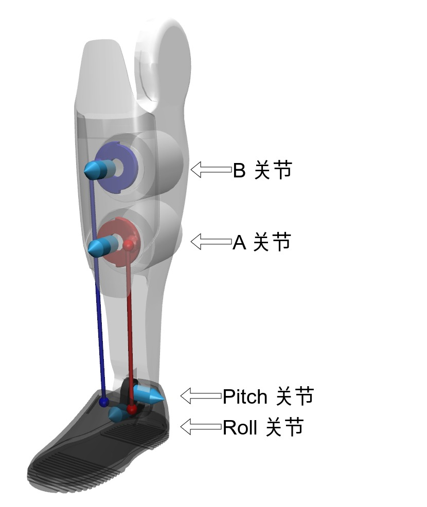
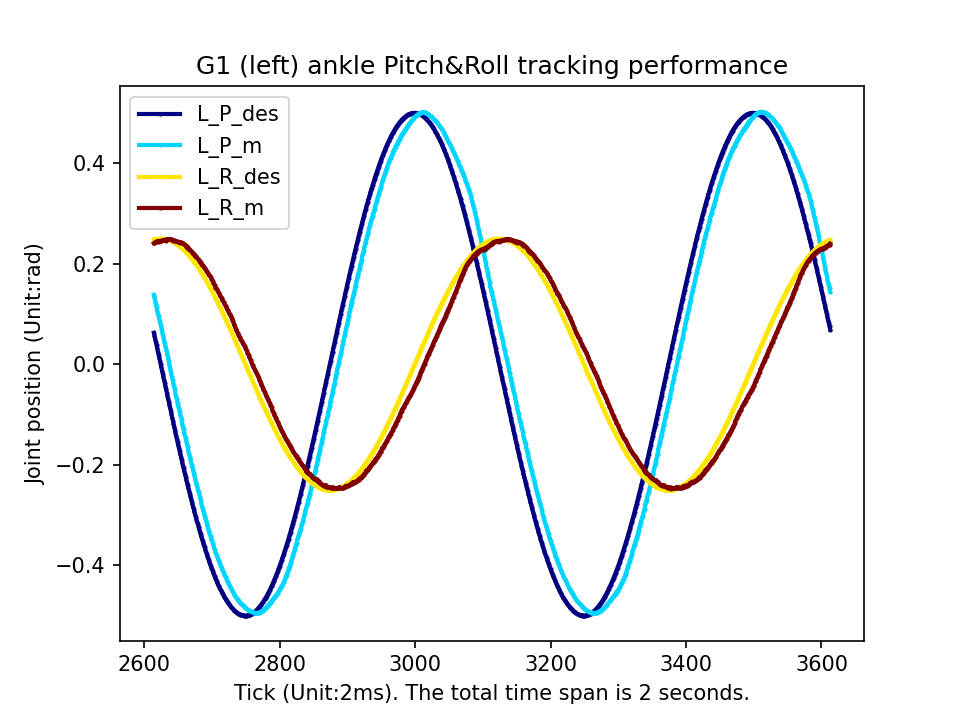
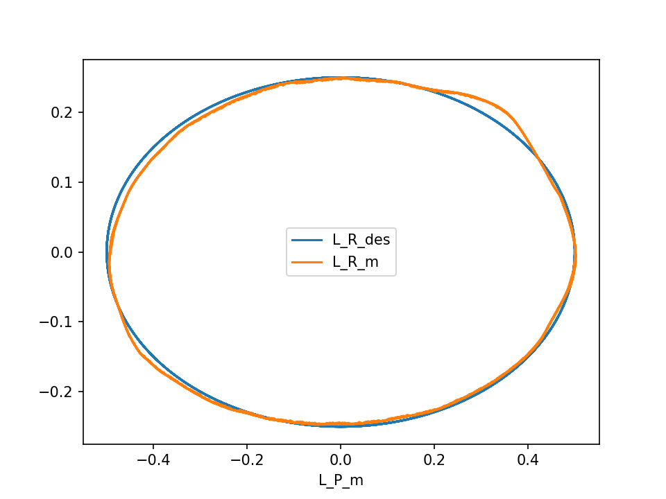

# Unitree G1 并联机构控制

## 并联机构控制接口

Unitree G1 机器人并联机构涉及机器人的脚踝和腰部控制。下面以 G1 脚踝关节为例，

<p align="center"></p>

硬件上，G1 踝关节采用并联机构。实际通过控制 A、B 关节电机间接控制串联的 Pitch、Roll 关节。

软件上，为了便于用户建模和控制，我们为用户提供了等价的串联关节控制接口，即 `PR 模式`，让用户直接控制串联 Pitch、Roll 关节。与普通关节控制一样，`PR 模式` 下每个串联关节接收以下指令：

| 指令名称   | 变量  |
| ---------- | ----- |
| 前馈力矩   | `tau` |
| 目标角度   | `q`   |
| 目标角速度 | `dq`  |
| 关节刚度   | `kp`  |
| 关节阻尼   | `kd`  |

最终串联关节执行总的力矩为 T = kp(q - q_m) + kd(dq - dq_m) + tau

为测试 G1 脚踝 `PR 模式` 控制效果，我们让脚踝来回摆动，参考 [例程](https://github.com/unitreerobotics/unitree_sdk2/blob/main/example/g1/low_level/g1_23dof_ankle_track.cpp)，位置跟踪效果如图：

<p float="middle">
  
  
</p>

观察发现串联 Pitch、Roll 关节能较准确的跟踪指令。为了实现并联控制转换为等价的串联控制，我们会同时考虑前馈力矩、目标角度、目标角速度、关节刚度和关节阻尼的转换，尽量保证关节控制精度。

## 腰部锁定方法

如果用户运行自己的控制器出现 G1 腰部关节 (俯仰和滚转) 抖动问题，则建议采取以下一种方法锁住腰部关节：

1. 硬件层面: 把 G1 机器人设置为 27 自由度，并用限位装置锁住腰部俯仰和滚转关节
2. 软件层面: 采用 PD 控制器锁住腰部俯仰和滚转关节 (用户需要机器人实际效果调节刚度和阻尼参数)

   ```c++
   motor_cmd.tau_ff.at(WaistRoll) = 0.0;
   motor_cmd.q_target.at(WaistRoll) = 0.0;
   motor_cmd.dq_target.at(WaistRoll) = 0.0;
   motor_cmd.kp.at(WaistRoll) = 80;  // 仅作参考，根据控制器实际效果修改
   motor_cmd.kd.at(WaistRoll) = 2;   // 仅作参考，根据控制器实际效果修改
   
   motor_cmd.tau_ff.at(WaistPitch) = 0.0;
   motor_cmd.q_target.at(WaistPitch) = 0.0;
   motor_cmd.dq_target.at(WaistPitch) = 0.0;
   motor_cmd.kp.at(WaistPitch) = 80;  // 仅作参考，根据控制器实际效果修改
   motor_cmd.kd.at(WaistPitch) = 2;   // 仅作参考，根据控制器实际效果修改
   ```
